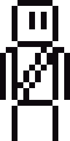

# Grapple Legacy

```text
  ________                           __         __                                __
 /  _____/___________  ______ _____/  |_______/  |   .____    ____   ____ ______/  |_ ___.__.
/   \  __\_  __ \__  \ \____ \\____ \   __\__  \   __\|    | _/ __ \ / ___\\__  \   __<   |  |
\    \_\  \  | \// __ \|  |_> >  |_> >  |  / __ \|  |  |    |_\  ___// /_/  >/ __ \|  |  \___  |
 \______  /__|  (____  /   __/|   __/|__| (____  /__|  |____/ /\___  >___  (____  /__|  / ____|
        \/           \/|__|   |__|             \/                  \/_____/     \/      \/

                               Rope. Momentum. Legacy.
```

<p align="center">
  
</p>

<p align="center">
  <strong>A fast, physics-driven 2D grapple platformer built with Electron + Phaser.</strong>
</p>

<p align="center">
  
  
  
  
</p>

## What Is This?

Grapple Legacy is a desktop platformer prototype where movement is built around momentum, rope physics, and platform navigation.

It is currently set up as:
- A single playable scene
- Keyboard movement + jumping
- Mouse-fired grappling hook
- Scroll-wheel reeling
- Rope wrap/unwrap behavior around geometry

## Features

- Tight platform movement with coyote time and jump buffering
- Grapple attach/release on click
- Physics rope chain with segment constraints
- Rope wrap detection around platform corners
- Rope unwrap when line-of-sight clears
- Player sprite rotation aligned to rope direction while swinging
- Camera follow and on-screen control hints

## Controls

| Action | Input |
|---|---|
| Move | `A` / `D` or Left / Right Arrow |
| Jump | `W`, Up Arrow, or `Space` |
| Fire / Release Grapple | Left Click |
| Reel Rope | Mouse Wheel |

## Tech Stack

- TypeScript
- Phaser 3 (Matter physics)
- Electron
- esbuild
- pnpm

## Getting Started

### Prerequisites

- Node.js (LTS recommended)
- pnpm

### Install

```bash
pnpm install
```

### Run (build + launch)

```bash
pnpm start
```

### Development Mode (watch + launch)

```bash
pnpm dev
```

### Other Scripts

```bash
pnpm build
pnpm watch
```

## Project Structure

```text
.
|- assets/
|  |- Grapple_Hook.png
|  \- Sprite.png
|- src/
|  |- main.ts
|  \- renderer/
|     |- game.ts
|     |- entities/
|     |  |- GrappleHook.ts
|     |  \- Player.ts
|     \- scenes/
|        \- GameScene.ts
|- index.html
|- package.json
\- tsconfig.json
```

## Gameplay Architecture (Quick Tour)

- `src/main.ts`: Electron window and app lifecycle.
- `src/renderer/game.ts`: Phaser game config (size, physics, scene boot).
- `src/renderer/scenes/GameScene.ts`: Level setup, platforms, camera, UI text, rope rendering.
- `src/renderer/entities/Player.ts`: Movement, jump logic, collision grounding, sprite sync.
- `src/renderer/entities/GrappleHook.ts`: Hook firing, raycasts, rope chain, wrap/unwrap, reeling.

## Roadmap / TODO

- Better wrapping around platforms
- Dynamic level generation
- Color theming
- Improved assets
- Test harnesses
- Deployment pipeline

## Contributing

Contributions are welcome.

Suggested workflow:
1. Create a branch for your change.
2. Keep updates focused and small.
3. Test gameplay manually (`pnpm dev`) before opening a PR.
4. Describe behavior changes clearly in your PR notes.

## License

Not specified yet (TBD).

---

If you are testing this as a player: focus on movement feel, grapple reliability, and whether swinging feels readable and fun.